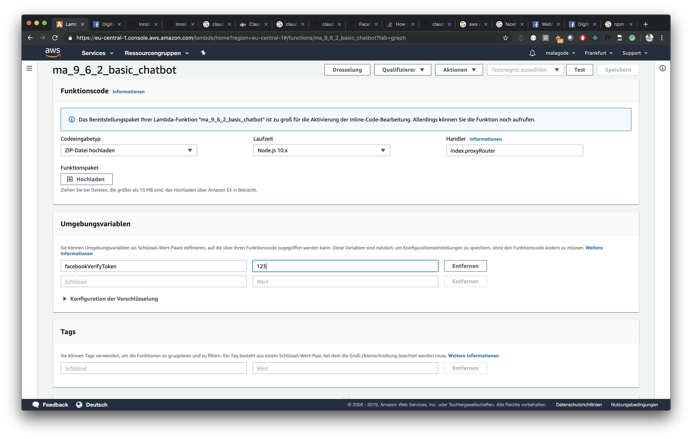
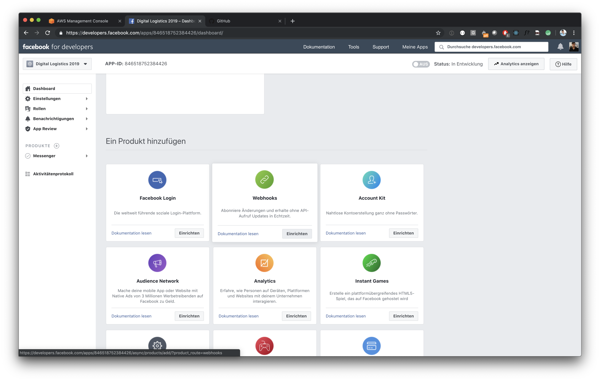
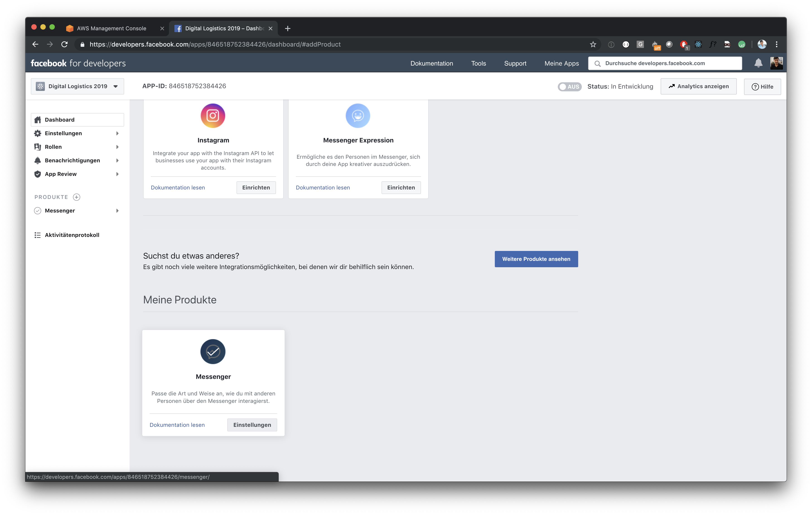
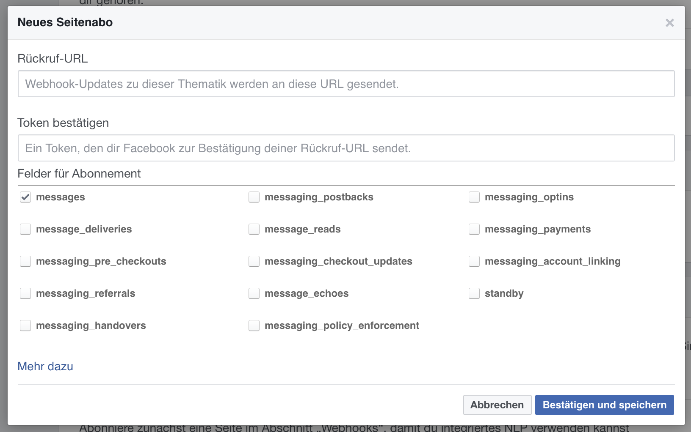
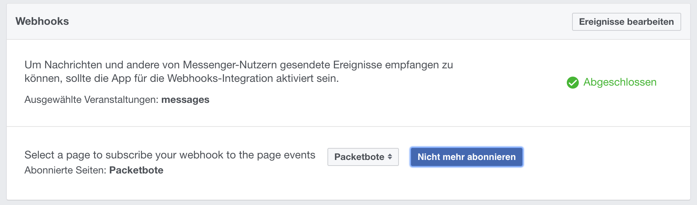
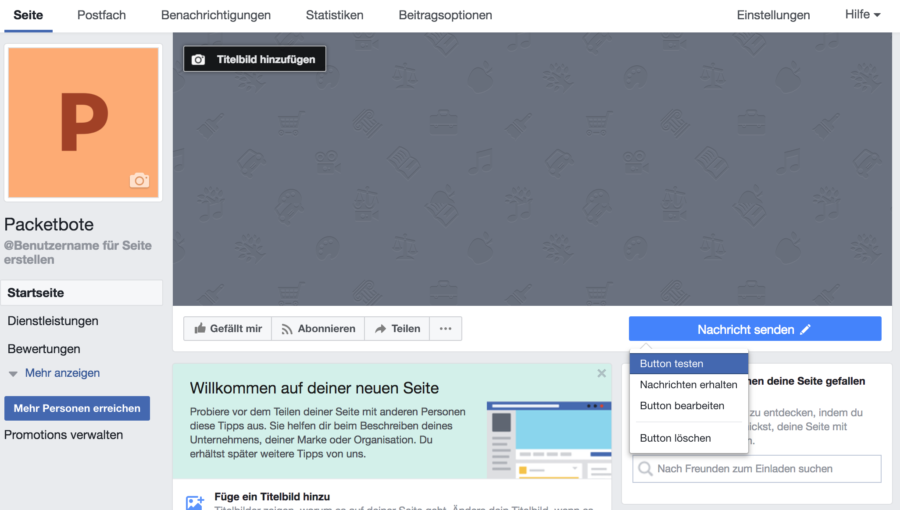
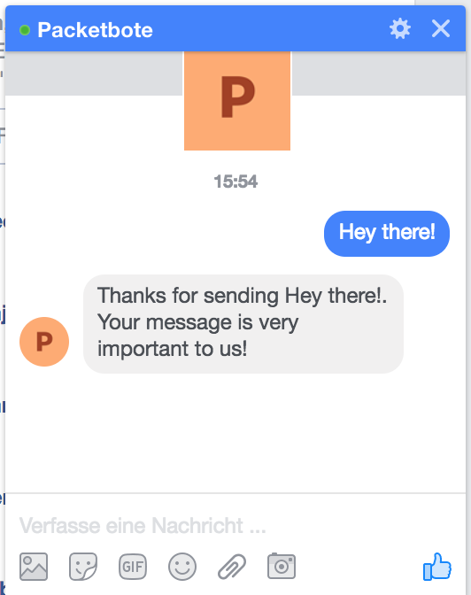

# Build a Hello World Chatbot

In this task you will create a Facebook Page, a Facebook App and a simple AWS lambda with Claudia.js, which will answer the messages sent to your Facebook Page.

1. To setup Facebook follow [our documentation](https://github.com/senacor/InnoLabFacebookMessenger/tree/master/docs/setup_facebook)!

2. Replace `<your_prefix>` in `package.json.template` with a unique prefix, otherwise you will get name collisions with other code camp participants. Rename `package.json.template` to `package.json`.

3. Run `npm run create` to create your lambda.

```
> npm run create
{
  "lambda": {
    "role": "ma_9_6_2_basic_chatbot-executor",
    "name": "ma_9_6_2_basic_chatbot",
    "region": "eu-central-1"
  },
  "api": {
    "id": "<an-random-id>",
    "module": "index",
    "url": "https://<an-random-id>.execute-api.eu-central-1.amazonaws.com/latest",
    "deploy": {
      "facebook": "https://<an-random-id>.execute-api.eu-central-1.amazonaws.com/latest/facebook"
    }
  }
}
```

4. ~~Run `npm run configure`~~ Unfortunately the claudia-bot-builder version 4.5.0 does not work with Facebook API version 3.3. There is a PR pending fixing this: https://github.com/claudiajs/claudia-bot-builder/pull/133

For now, find the AWS lambda you just created using claudia.js, in the AWS web interface and set an environment variable called `facebookVerifyToken` with any secret value. We are going to use that secret later.



5. Now, we need to link the app to AWS and to the page. Therefore, we add a Webhook where incoming messages are forwarded to.

Go to `"Produkte" --> Webhooks --> "Einrichten"`



Go to `"Produkte" --> Messenger --> "Einrichten"`



5. A click on "Webhooks einrichten" opens a popup to define the Callback-URL and the Verification Token for the Webhook. Insert `https://<restapi_id>.execute-api.eu-central-1.amazonaws.com/latest/facebook` as an URL and `<an-random-id>` as an token.

`<restapi_id>` can be obtained from the API Gateway in the AWS webinterface, which claudia.js created for us. The `<an-random-id>` is the secret value you entered as `facebookVerifyToken` previously.



6. Finally, we must define a page from which the app should receive notifications. We choose the one created earlier.



7. Write to your bot, wait for the response.





8. Go to [AWS CloudWatch](https://eu-central-1.console.aws.amazon.com/cloudwatch/home?region=eu-central-1#) and inspect your lambda's log files at "Protokolle".
