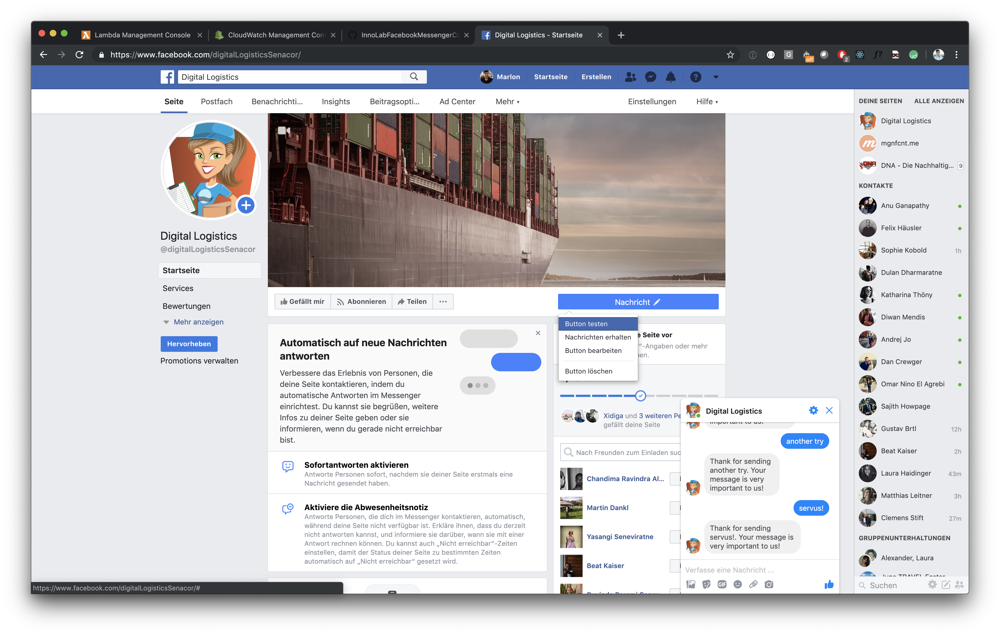

# Build a Hello World Chatbot

In this task you will create a Facebook Page, a Facebook App and a simple AWS lambda with Claudia.js, which will answer the messages sent to your Facebook Page.

## 1. Facebook Page and App

To setup Facebook follow [our documentation](https://github.com/senacor/InnoLabFacebookMessenger/tree/master/docs/setup_facebook)!

## 2. Edit package.json

Replace `<your_prefix>` in `package.json.template` with a unique prefix, otherwise you will get name collisions with other code camp participants. Rename `package.json.template` to `package.json`.

## 3. Create AWS Lambda and API Gateway

Run `npm install`

Run `npm run create`, claudia.js will create a Lambda and an API Gateway at AWS.

```
> npm run create
{
  "lambda": {
    "role": "ma_9_6_2_basic_chatbot-executor",
    "name": "ma_9_6_2_basic_chatbot",
    "region": "eu-central-1"
  },
  "api": {
    "id": "<an-random-id>",
    "module": "index",
    "url": "https://<an-random-id>.execute-api.eu-central-1.amazonaws.com/latest",
    "deploy": {
      "facebook": "https://<an-random-id>.execute-api.eu-central-1.amazonaws.com/latest/facebook"
    }
  }
}
```

## 4. Configure Facebook Webhook

~~Run `claudia update --configure-fb-bot`~~ Unfortunately the claudia-bot-builder version 4.5.0 does not work with Facebook API version 3.3. There is a PR pending fixing this: https://github.com/claudiajs/claudia-bot-builder/pull/133

Until its claudia.js is fixed you need to do the following manuelly: Navigate to your [API Gateway at the AWS Web Console](https://eu-central-1.console.aws.amazon.com/apigateway/home?region=eu-central-1#/apis) --> "Stufen" --> "latest" --> "Stufenvariablen" and set a variable called `facebookVerifyToken` with any secret value. We are going to use that secret later.


In order to call the Facebook API claudia.js needs a facebookAccessToken and a facebookAppSecret. claudia.js expects those variables at different locations. 
* Add the facebookAccessToken as stage variable as you did in [task 1](../01_build_hello_world_chatbot), find the value at "Messenger" --> "Zugriffsschlüssel"
* Add the facebookAppSecret as environment variable at your [Lambda at the web console](https://eu-central-1.console.aws.amazon.com/lambda/home?region=eu-central-1#/functions), find the value at [your Facebook App](developers.facebook.com) at "Einstellungen" --> "Allgemeines"


## 5. Add Webhook and Messenger API to Facebook Page

Now, we need to link the app to AWS and to the Facebook Page. Therefore, we add a Webhook where incoming messages are forwarded to.

Add [Facebook Developers](developers.facebook.com) to `"Produkte" --> Webhooks --> "Einrichten"`


... and then go to `"Produkte" --> Messenger --> "Einrichten"`


## 6. Link Facebook App <--> AWS Lambda

A click on "Webhooks einrichten" opens a popup where a Callback-URL and the Verification Token can be set. Insert the URL from `api.deploy.facebook` retrieved at `npm run create` previously.

As a token enter the secret value you defined as `facebookVerifyToken` previously.

Choose `messages` from "Felder für Abonnement".


## 7. Link Facebook Page <--> Facebook App

Finally, we must define a page from which the app should receive notifications. We choose the one created earlier.


## 8. Test it

Write to your bot, wait for the response.



## 9. Inspect it

Go to [AWS CloudWatch](https://eu-central-1.console.aws.amazon.com/cloudwatch/home?region=eu-central-1#) and inspect your lambda's log files at "Protokolle".
