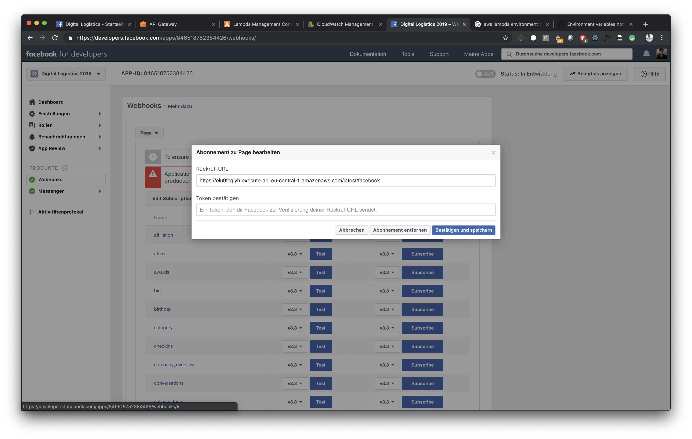
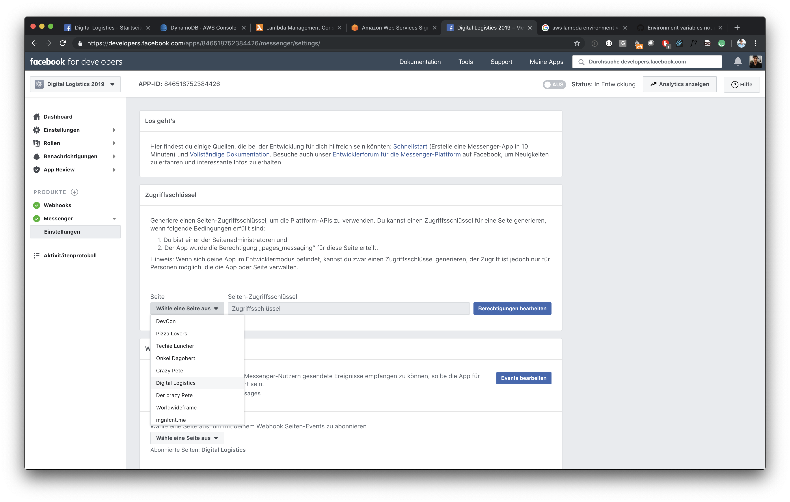
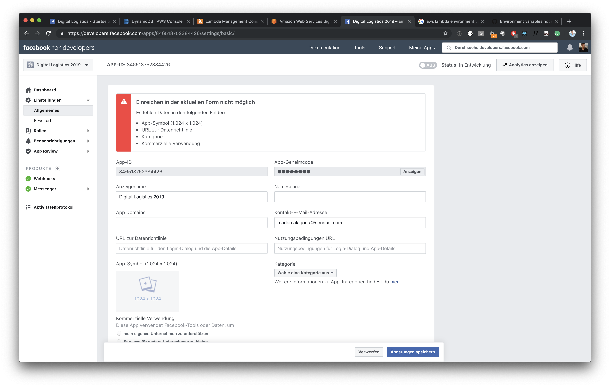
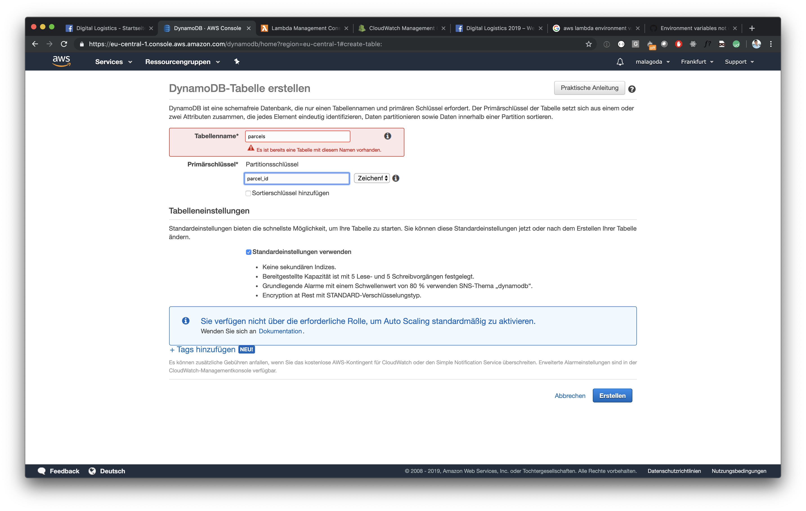
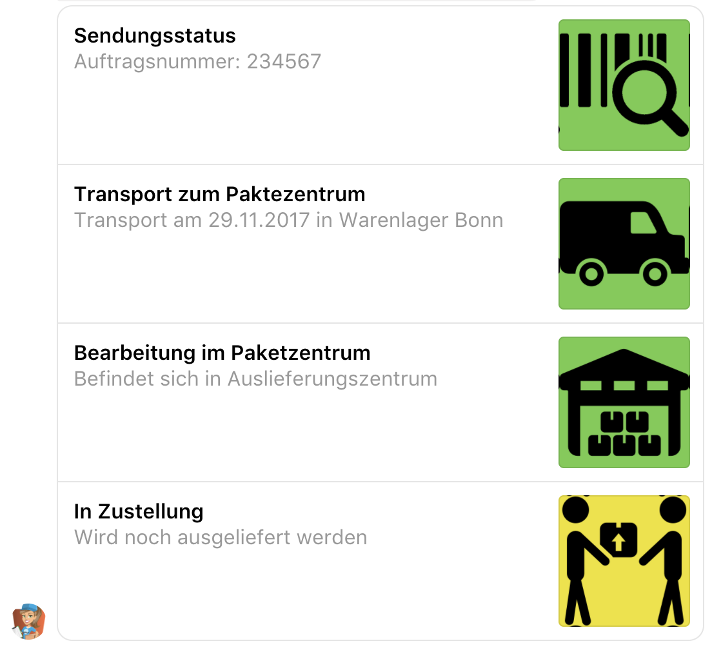

# Parse input, read from DB and use Facebook templates

In this task you will extend the lambda from [task 1](../01_build_hello_world_chatbot). Your chatbot will be able to react to certain keywords, read status information from a database and return Facebook templates.

## 1. Parse incomming message

Use Regex to parse your message, ensure the keyword "status" and an eight digit parcel number are part of the message. If it is not, let the user know, that you don't know what he is talking about. You can either return a single message (as in [task 1](../01_build_hello_world_chatbot)), a list of messages or a promise, resolving with message(s). When doing IO operations like DynamoDB reads, as you will do later in this task, you need to return a promise and resolve it with your response as soon as your asynchronous tasks are done.

```
var botBuilder = require('claudia-bot-builder')
module.exports = botBuilder(request => new Promise(resolve => {
    // ... do some asyc stuff

    resolve('Thank for sending ' + request.text + '. Your message is very important to us!')
}), {platforms: ['facebook']}
```

## 2. Connect to DynamoDB

Make sure your lambda is authorized to access DynamoDB, by deleting and re-creating it with the correct policies. Extend the create script in your package.json `claudia create --region eu-central-1 --api-module index --name <your_prefix>_chatbot` with `--policies /path/to/the/policies/folder` and then run the following commands.

```
cd /to/package.json
npm run destroy
npm run create
```

claudia.js will create an return a new URL to your Lambda. Set the `facebookVerifyToken` stage variable at your new API Gateway as in [task 1](../01_build_hello_world_chatbot) and change the webhook URL of your Facebook App.



claudia.js needs a `facebookAccessToken` and a `facebookAppSecret` in order to call the Facebook API asynchronously and reply messages after certain IO operations are done. Since `claudia update --configure-fb-bot` does not work with the current version of claudia and the most recent Facebook API, as discussed previously, you have to add those variables manually. claudia.js expects those variables at different locations. Add the `facebookAccessToken` as stage variable as you did in [task 1](../01_build_hello_world_chatbot) and add the `facebookAppSecret` as environment variable at your [Lambda at the web console](https://eu-central-1.console.aws.amazon.com/lambda/home?region=eu-central-1#/functions). Find the values at [your Facebook App](developers.facebook.com) at "Einstellungen" --> "Allgemeines" and "Messenger" --> "Zugriffsschlüssel".




## 3. Create a DynamoDB called "parcels" and add entries



## 4. Read the requested status from DynamoDB by the parcel id

Make sure to install aws-sdk and dynamodb-doc dependencies!

```
npm install aws-sdk
npm install dynamodb-doc
```

The following code shows how to read from DynamoDB.

```
const aws = require('aws-sdk')
const DOC = require('dynamodb-doc')

aws.config.update({region: 'eu-central-1'})
const docClient = new DOC.DynamoDB()

const param = {
    TableName: 'parcels',
    Key: {
        parcel_id: '<parcelId>'
    }
}

docClient.getItem(param, (err, res) => {
    // ...
})
```

## 3. Formatted result

Return a [Facebook list template](https://developers.facebook.com/docs/messenger-platform/send-messages/template/list) representing the parcel's status. Optional: You can use Claudia.js [Facebook Template Builder](https://github.com/claudiajs/claudia-bot-builder/blob/master/docs/FB_TEMPLATE_MESSAGE_BUILDER.md) for that task.



If you don't want to use (and host) your own icons, we provide you online available images for all possible status, have a look at [our S3 bucket](https://s3.console.aws.amazon.com/s3/buckets/digital-logistic-web/?region=eu-central-1&tab=overview).
