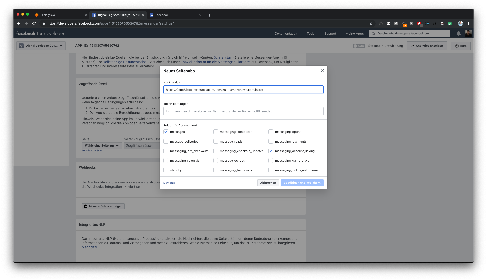

# Link user's Facebook account

Since you don't want to allow everybody to reroute every parcel, but only authorized users, you need to verify their identity. You can do this by using [Facebook's account linking process](https://developers.facebook.com/docs/messenger-platform/identity/account-linking).

## Handle Digital Logistics login

See `./login_handler` for code.

Before you can link the Digital Logistic account with the Facebook account, the user has to login to the Digital Logistics account itself. We need a service to handle this logins.

1. Replace `<your_prefix>` at `login_handler/package.json.template` and rename it to `login_handler/package.json` to start.

2. Implement `login_handler/index.js`, see TODOs

3. Deploy handler

```
cd /path/to/login_handler
npm run create
```

## Provide login dialog

The user needs a GUI to login to the Digital Logistic account, we need to provide it, Facebook will serve this GUI in a popup.

See `./login_dialog` for code.

1. Replace `<login_handler_url>` with the URL of the lambda you just deployed and rename the file from `<your_prefix>-login.html.template` to `<your_prefix>-login.html`, while replacing `<your_prefix>`.

2. Replace `<your_prefix>-login.html` at `deploy.sh`

3. Deploy the static html page to AWS S3

```
cd /path/to/login_dialog
./deploy.sh
```

## Handle Facebook's (un-)linking events

See `./fb_webhook` for code.

1. Since all Facebook requests resolve to a single webhook, but you cannot handle login requests in Dialogflow, you need to filter those requests and only redirect all non-linking requests to Dialogflow. Replace `<your_prefix>` at `fb_webhook/package.json.template` and move it to `fb_webhook/package.json` to start.

2. Deploy your lambda by typing `npm run create`.

3. Since we cannot use the Claudia.js bot builder for this task, because we want Facebook requests to be handled in Dialogflow, we need to configure our Facebook/lambda setup manually. At the AWS web console go to the AWS lambda you just deployed and find the section "Environment variables". Create two variables. Make sure to replace the `<placeholders>`!

```
dialogflow_webhook: https://bots.dialogflow.com/facebook/<dialogflow_agent_id>/webhook
facebook_verify_token: <a-random-string>
```

4. Now go to your Facebook app page -> Webhooks and remove the current webhook by clicking on `Edit subscription`.

5. Now add a new webhook at Facebook app page -> Messenger -> Section "Webhooks" and follow the instructions. Find the lambda's link at the CLI output of the `npm run create` command you run previously and make sure to tick `messages` and `messaging_account_linking`. Use the `<a-random-string>` you defined at step 3 as Verify Token. Go to AWS CloudWatch and verify your lambda got called by inspecting the log output.



6. At the Webhooks sections, subscribe to your Facebook page.

7. Now deploying and configuring is done, implement the `linkAccount` and `unlinkAccount` methods at `index.js` and update the lambda by typing `npm run update`.

## Provide user Login and Logout button

Build an Dialogflow intent, which returns the user a login or logout button. You can make this very advanced, however we are going to describe the most simple setup.

1. Create a Login intent. Train it with some login statements.

2. Add a custom payload response, make sure to replace `<your_prefix>`.

```
{
  "facebook": {
    "attachment": {
      "type": "template",
      "payload": {
        "template_type": "button",
        "text": "Verknüpfe deinen Digital Logistics Account",
        "buttons": [{
          "type": "account_link",
          "url": "https://s3.eu-central-1.amazonaws.com/digital-logistic-web/<your_prefix>-login.html"
        }]
      }
    }
  }
}
```

3. Create a logout intent with a custom payload response.

```
{
  "facebook": {
    "attachment": {
      "type": "template",
      "payload": {
        "template_type": "button",
        "text": "Entknüpfe deinen Digital Logistics Account",
        "buttons": [{
          "type": "account_unlink"
        }]
      }
    }
  }
}
```

4. **Bonus task**: You can call a lambda asking if the user already is logged in and provide a response accordingly. E.g. "You are already logged in" or "Please login before trying to logout"
