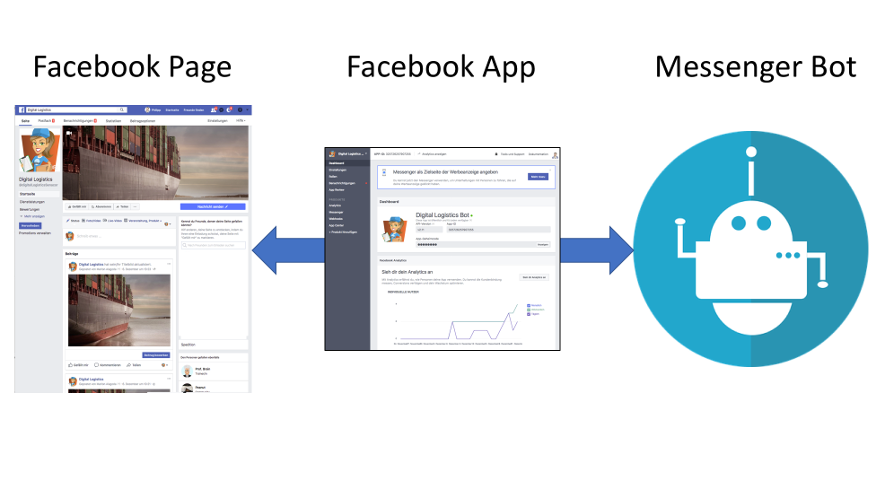

# Create a empty chatbot in facebook

In this task you will create a Facebook Page, a Facebook App and a new
and empty dialogflow agent, which will answer the messages sent to your
Facebook Page with its default answer.

## Task

Please create a new Facebook page for your fictional logistic company
with a messenger that can response auto response greetings.

## Steps

1. To setup Facebook (Page and Agent) follow
   [our documentation](https://github.com/senacor/InnoLabFacebookMessenger/tree/master/docs/setup_facebook)!

2. Create a new agent at [Dialogflow](https://console.dialogflow.com)

3. Connect Dialogflow with the facebook agent.

4. Check if you receive the default answer in you facebook chat.
