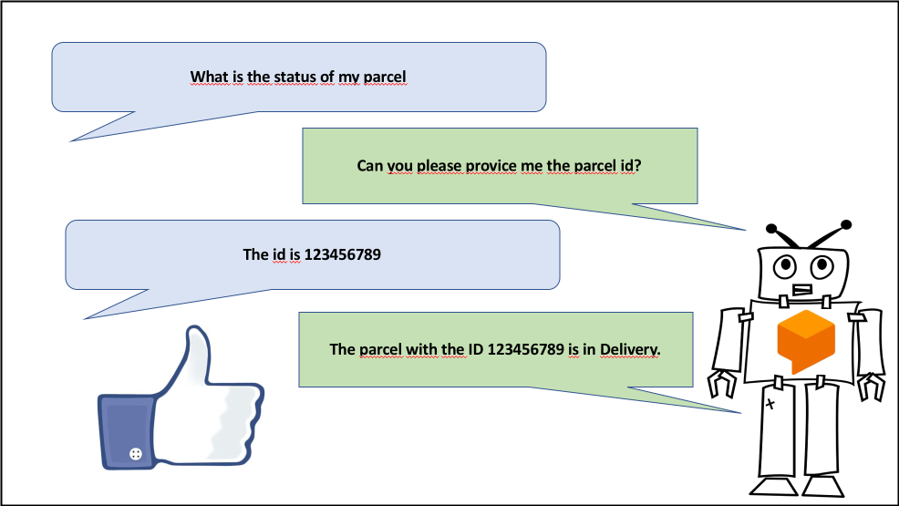

# Build a conversational Chatbot

During this task you will ehance you empty chatbot in Dialogflow.

Dialogflow enables human-like conversations and identifying a user's
intent. During this task we will build a
[a linear dialog](https://dialogflow.com/docs/dialogs).

## Task

The chatbot should be able to response with a static status information
when a user request the status of a Parcel by giving the parcel ID.

If the user do not give the parcel ID in this first messages the bot
should ask for the missing id.

## Steps

1. To extract information out of user inputs, create the entity you want
to extract: `parcel_id`. Disable "Define synonyms" and enable "Allow
automated expansion". Enter "@sys.number:parcel_id" as value, to extract
numbers.

2. Create the intent you want to handle "Parcel Status Request". Train
Dialogflow to recognize this intent with a couple of sentences. Add the
entity you just created as required parameter and define some prompts
for it. Add a response, similar to "The parcel with the id $parcel_id
will arrive tomorrow!".

3. You can test your solution via the "Try it now" text input field in
the top right corner.
